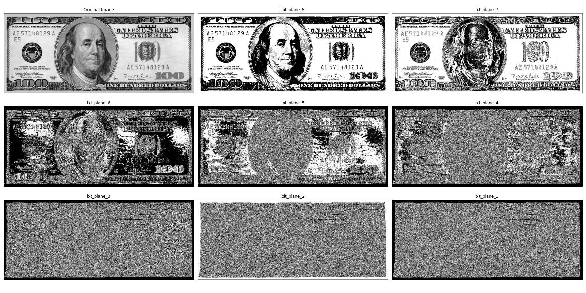

# Intensity-Transformation-in-Images-using-Python
Intensity Transformation in Images using Python: Performing Intensity Transformation, log transformation, power law (Gamma) Transformation, Intensity Level slicing, bit level slicing in python

## Bit-plane Slicing -> 

